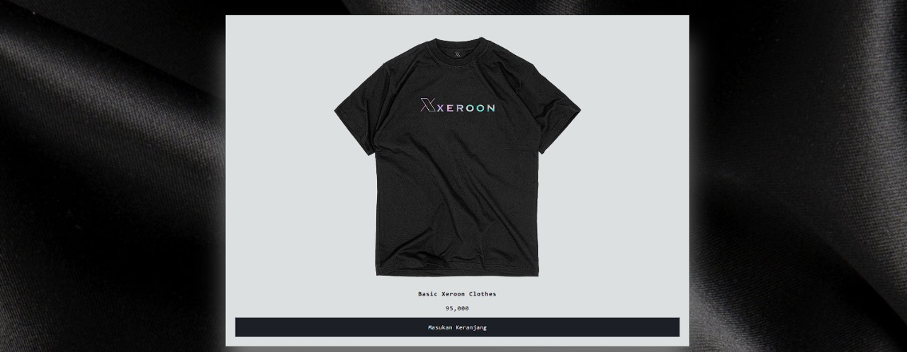

# xeroonstore
<h2><b>1. Menampilkan Navbar</b></h2>
Navbar ini terdiri dari 2 objek gamar yaitu logo dan gambar keranjang
- Ketika menekan loga maka akan merefresh page
- Ketika menekan keranjang maka kan masuk ke dalam wishlist


<b>HTML</b>
```html
<nav class="bg-black fixed w-full pt-0">
    <div class="max-w-screen-xl flex flex-wrap items-center justify-between mx-auto p-4">
        <a href="index.html"></a>
        <div class="shopping">
            
        </div>
    </div>
</nav>
```

<h2><b>2. Content</b></h2>
Didalam content ini semuanya berada di css dan javascript, yang ada di HTML hanya classnya saja



<b>HTML</b>
```html
<div class="m-auto max-w-5xl pt-20">
<header>
    <div class="list"></div>
        <div class="card">
             <h1 class="flex text-2xl font-extrabold m-0 py-10 px-10 items-center text-white">Keranjang Anda</h1>
                <ul class="listCard"></ul>
                <div class="checkOut">
            <div class="total">-</div>
        <div class="closeShopping">Keluar</div>
        </div>
    </div>
</div>
</header>
```

<b>JavaScript</b>
```js
let products = [
  {
    id: 1,
    name: "Basic Xeroon Clothes",
    image: "1.png",
    price: 95000,
  },
  {
    id: 2,
    name: "Basic Logo Xeroon Clothes",
    image: "2.png",
    price: 90000,
  },
  {
    id: 3,
    name: "Xeroon Clothes With Lofi Theme",
    image: "3.png",
    price: 105000,
  },
]
```

## Cara Kerja Web
Ketika kita menekan button 'Masukan Keranjang' maka produk itu akan ada di wishlist, dan jika kita menekan icon Wishlist maka kta akan melihat produk yang telah ditambahkan.

Didalam wishlist kita bisa menambah jumlah produk yang akan dibeli, dan secara otomatis total harga akan keluar.